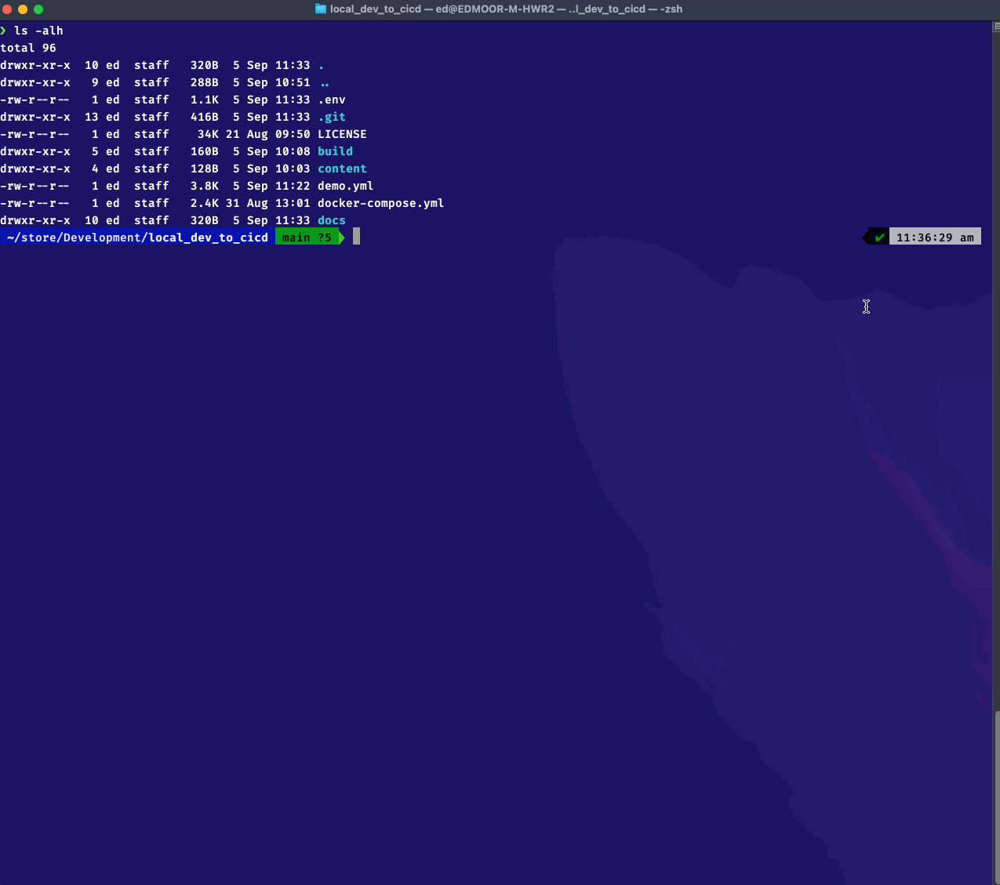

# All Hands on Deck
Now, we will start to make our first changes to our config and build the foundation for our CI/CD pipline that we will create later.

## Manual Labour
First, go ahead and make a manual change to the configuration of the interface that has been assigned to you.

For this, you can connect to the **dev** Switch on 198.18.132.151 via SSH. 
You will find yourself on the command line with the enabled prompt **`#`**

Your first task is to go into the configuration mode and change the description of your assigned interface. Maybe you could mark it with your name?

If you have trouble doing this on your own you can find the solution down below.
<details>

<summary>Click here to show solution</summary>
  
  ```bash linenums="1" title="Manual Configuration Example"
      Cat9kv-01#

      # Let's check the current interface config

      Cat9kv-01#sh run | section interface
      interface GigabitEthernet0/0
        vrf forwarding Mgmt-vrf
        ip dhcp client client-id GigabitEthernet0/0
        ip address dhcp
        negotiation auto
      interface GigabitEthernet1/0/1
      interface GigabitEthernet1/0/2
      interface GigabitEthernet1/0/3
      ...

      Cat9kv-01#
      Cat9kv-01#conf t
      Cat9kv-01(config)#interface GigabitEthernet 1/0/1 
      Cat9kv-01(config-if)#description Configured manually by frewagne
      Cat9kv-01(config-if)#end

      # Now check the config of the interfaces again

      Cat9kv-01#sh run | section interface
      interface GigabitEthernet0/0
        vrf forwarding Mgmt-vrf
        ip dhcp client client-id GigabitEthernet0/0
        ip address dhcp
        negotiation auto
      interface GigabitEthernet1/0/1
        description Configured manually by frewagne
      interface GigabitEthernet1/0/2
      interface GigabitEthernet1/0/3
      ...
  ```

</details>

## Loading your toolbelt

Now, you might want to get you hands less dirty than using th CLI manually every time you make a change to one device. Or what do you do when you need to make changes to multiple devices?
There are plenty of tools that can help you work with your devices and automate some simple workflows already.
One example of this is [Netmiko](https://github.com/ktbyers/netmiko). 

We will make a short example here on how to use Netmiko to configure our interface using a python script.

For this, you will need Python installed on your machine, but you can also follow the demo in the session.

To install netmiko, simply use pip:

`$ pip install netmiko``

We will use the following small python script:
```python
    from netmiko import ConnectHandler

    cat_dev = {
        'device_type': 'cisco_xe',
        'host':   '198.18.132.151',
        'username': 'admin',
        'password': 'C1sco12345',
    }
    net_connect = ConnectHandler(**cat_dev)
    # Execute Show Command
    output = net_connect.send_command('show run | section interface')
    print(output)
    print("\n")
    config_commands = [ 'interface GigabitEthernet 1/0/1',
                        'description Configured with netmiko by frewagne'
                    ]
    # Use your assigned interface to configure!
    output = net_connect.send_config_set(config_commands)
    print(output)
    print("\n")
    output = net_connect.send_command('show run | section interface')
    print(output)
```

Execute the python script using `python3 netmiko_interface_description.py`

Once the script has been successfully executed, we can check the current interface config:
```
    Cat9kv-01#sh run | section interface
    interface GigabitEthernet0/0
      vrf forwarding Mgmt-vrf
      ip dhcp client client-id GigabitEthernet0/0
      ip address dhcp
      negotiation auto
    interface GigabitEthernet1/0/1
      description Configured with netmiko by frewagne
    interface GigabitEthernet1/0/2
    interface GigabitEthernet1/0/3
    ...
```

## All hands on GitLab
From the root of the cloned repository, bring up the containers using docker compose as described in the Readme file of the repo:

This project is extremely simple, it requires only docker to be installed on the host and this repository to be cloned or manually copied. *default today is compose version 2*

**You might have to change the `EXT_IMG_VERSION_GITLAB` variable in the `.env` file in this repository, depending on what's your processors architecture!**

1. To start the service simply run either of the following:
   1. (Version 1) ```docker-compose up -d```
   2. (Version 2+) ```docker compose up -d```
2. Check containers are spinning up
3. Go have a cup of tea for 5 minutes while gitlab get's ready.
4. Access gitlab in your browser : http://localhost:2080
5. Access devtools from cli : ```docker exec -it engine_devtools bash```

Should look something like this:



Once all the containers are up and running, you  got yourself a great automation toolset and a GitLab instance of your own! All inclusive a GitLab runner that will take care of the execution of our pipeline later on.

You can now access your GitLab instance under `localhost:2080` in your browser and log in with the specified credentials:
- default_user
- C1sco12345

Once you successfully authenticated, you will see an existing project called `Default Resources` in which you will find a folder structure named `Ansible/playbooks` where we will store the files that will make up our device configuration.

Now you have the foundation for the pipeline! In this project repository we will store our files and add a CI file which can be interpreted by GitLab and is the collection of stages and tasks that will make up our pipeline in the end.
Next we will add our configuration template to our repository. Storing it centrally in the repo enables tracking of changes, collaborative work and rollback of commits if needed.
After our playbook is stored, we will create the CI file called `.gitlab-ci.yml`. Here we will describe the procedure of our pipeline. We will start with a basic dummy skeleton.

```
stages:
    - dummy

dummy-job:
    stage: dummy
    script:
        - echo "This pipeline is triggered successfully!"
```

#TODO
-	Add files to project
-	Create CI file
-	Test commit
