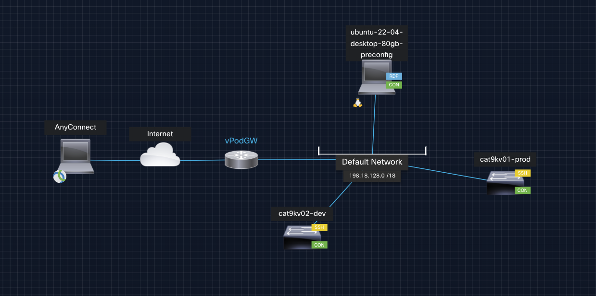

# Introduction to our Project

Don't worry - you are not expecting to come up with a project from the ground up. Instead we'll be working on a small sample project that you can find in [this](https://github.com/moore-automation/local_dev_to_cicd) repository. 

For this first small project, we will take network device configuration as an example of version-controlled files that will be applied to the devices in our environment through our pipeline later.

## Prerequisites

To follow this Workshop you should have these things:
- Docker (covered in previous Hands-On session)
- GitLab Account to save the project in a repo
- VPN Client for connection to dCloud (AnyConnect)

## The Project

In this project, we will work through different approaches of network device configuration and their principiles.

In the first section, we will start with the classic manual method of on-device CLI configuration - the good old reliable.
Next, we will progress and examine different tools and processes that will support us - doing these changes for us. Afterwards we will shed the light on the centralized approach using a project in GitLab and start to build the foundation for our fully automated pipeline. 

In the second section we will create different stages for our pipeline that will handle different things for us. We will have different environments to deploy our changes to - to test and examine them and their impact.
With all these previous building blocks, you will bring everything together: From centralized files pushed, tested and deployed through your pipeline into your environment.

## Topology

